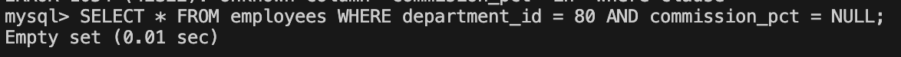
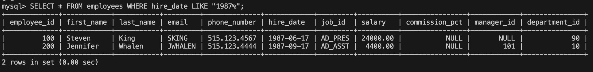
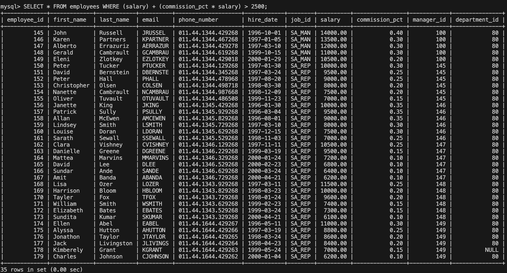
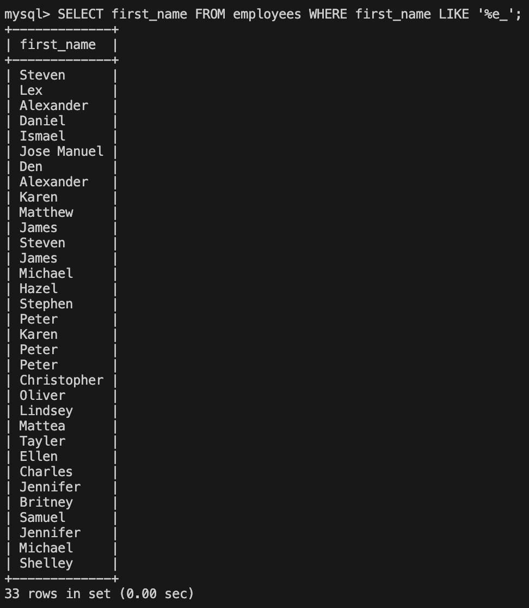
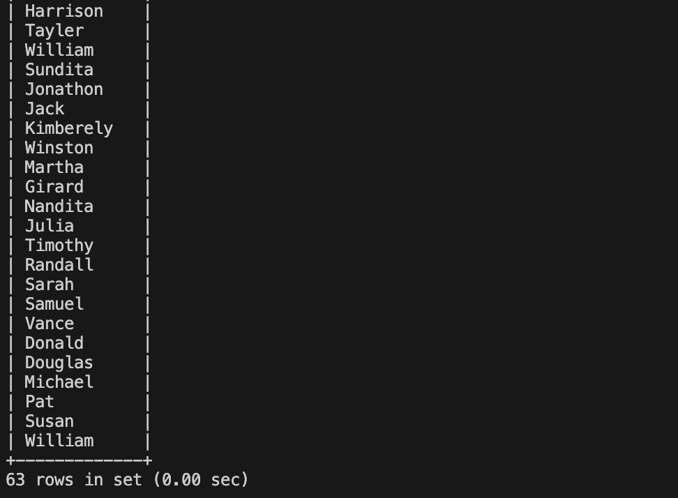
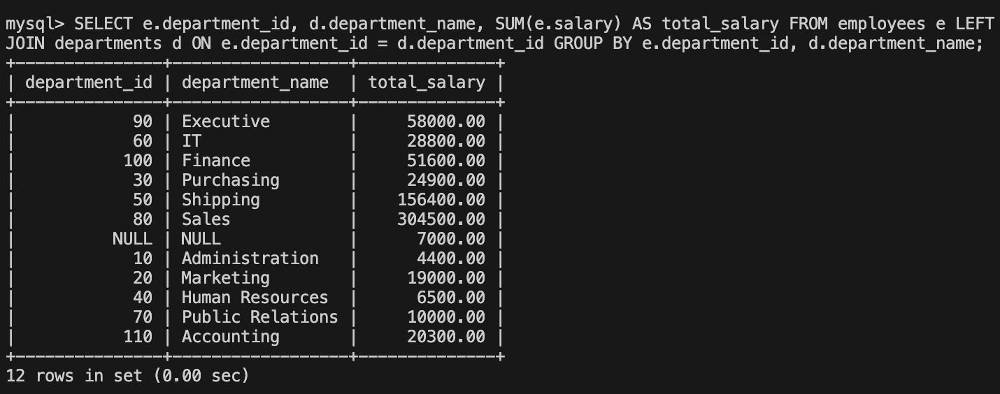
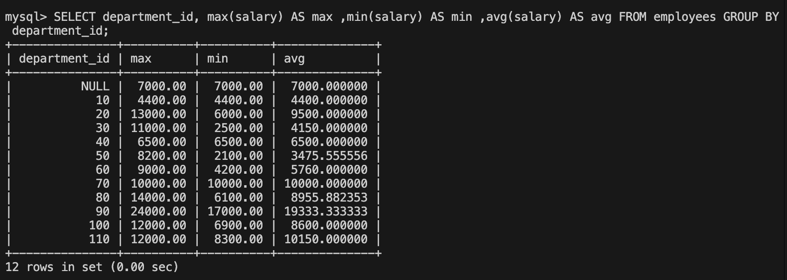

# SCRIPTS SQL PARA EL MASTERCLASS CON VICTOR Y JORGE
### Alla Harutyunyan - 12/03/2025

| Petición | Script SQL | Respuesta | Imágen |
|-----------|-----------|-----------|-----------
| 1. Consultar los empleados del departamento  de ventas que no tienen comisión.   | SELECT *  FROM employees  WHERE department_id = 80 AND commission_pct = NULL;   | Empty set  |  |
| 2. Consultar los empleados que ingresaron en 1987   | SELECT *  FROM employees  WHERE hire_date LIKE "1987%";   | 2 rows in set   |  |
| 3. Consultar los empleados cuyo ingreso (salario + comisión) supera los 2500.    | SELECT *  FROM employees  WHERE (salary) + (commission_pct * salary) > 2500;   | 35 rows in set   |  |
| 4. Consultar los empleados cuya penúltima letra de su nombre es E.    | SELECT first_name  FROM employees  WHERE first_name LIKE '%e_';   | 33 rows in set   |  |
| 5. Consultar los empleado que la segunda letra de su nombre puede ser A, i, o, u.    | SELECT first_name FROM employees WHERE first_name LIKE '_a%' OR first_name LIKE '_i%' OR first_name LIKE '_o%' OR first_name LIKE '_u%';   | 63 rows in set   |  |
| 6. Se necesita saber cuánto es el gasto total en salarios por cada departamento.    | SELECT e.department_id, d.department_name, SUM(e.salary) AS total_salary  FROM employees e  LEFT JOIN departments d ON e.department_id = d.department_id  GROUP BY e.department_id, d.department_name;   | 12 rows in set   |  |
| 8. Se necesita saber el salario máximo, mínimo y el salario promedio por departamento.    | SELECT department_id, max(salary) AS max ,min(salary) AS min ,avg(salary) AS avg FROM employees GROUP BY department_id;   | 12 rows in set   |  |